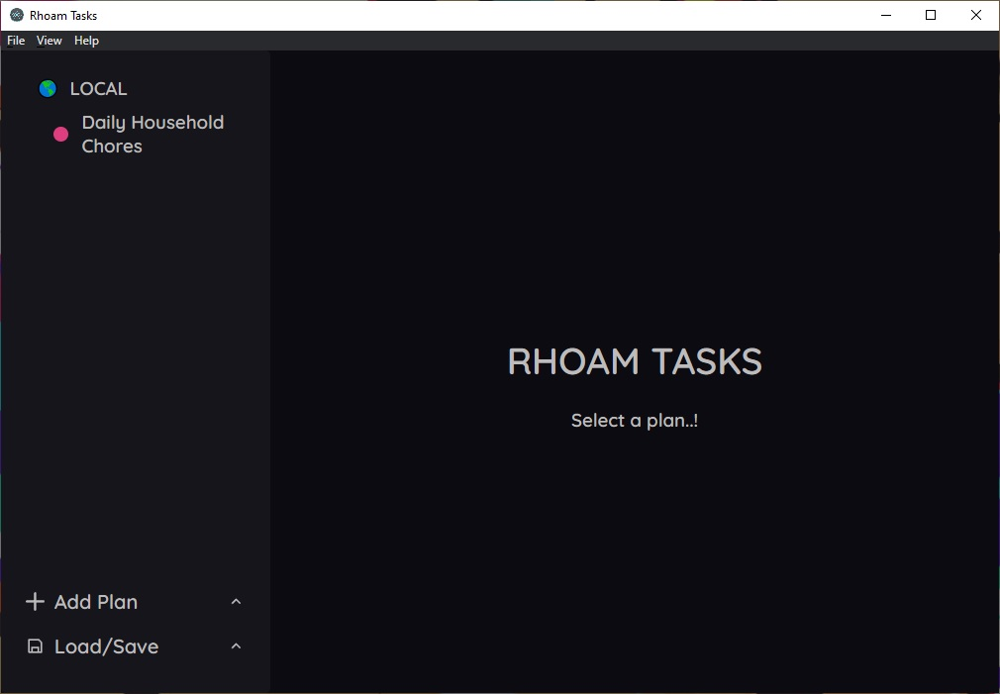
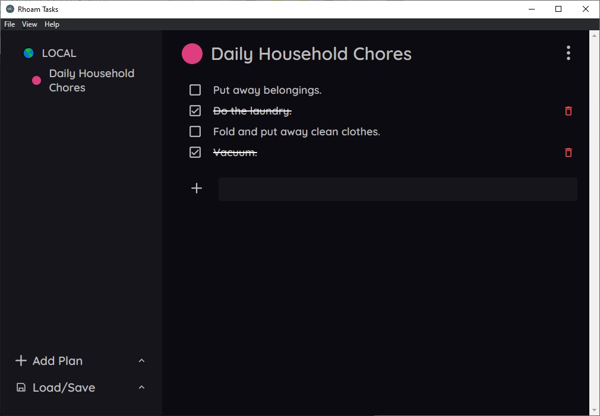
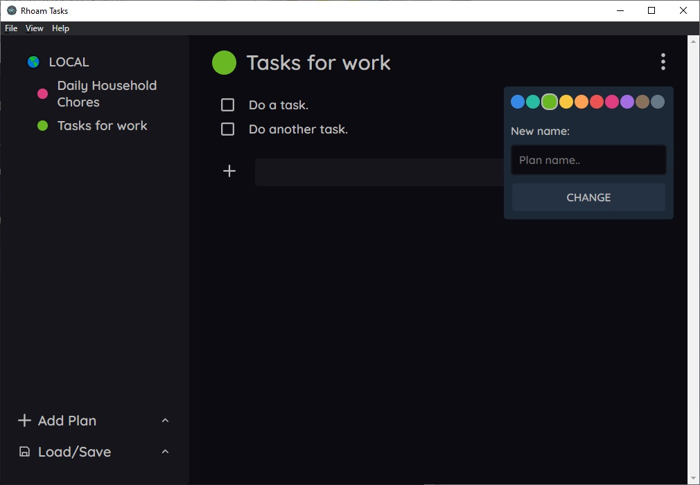
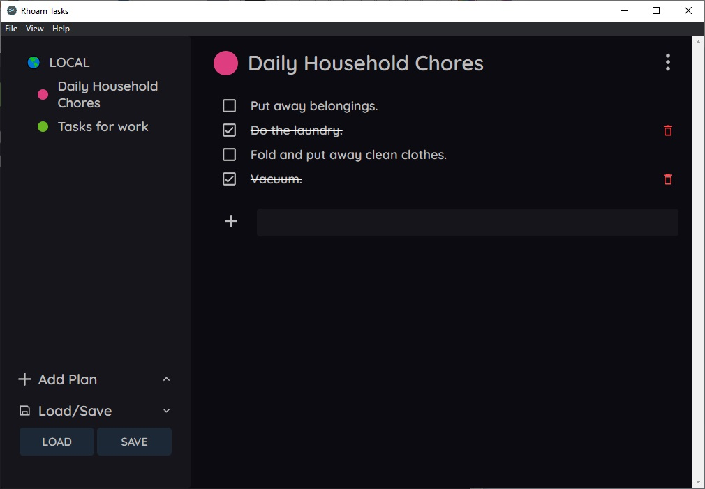

A small TypeScript - Electron demo to plan tasks.

A user can make plans with tasks and save them locally to his computer.

<a href="https://www.dropbox.com/s/qglp5532vwx1loh/RhoamTasks%20Setup%204.5.0.exe?dl=0">Download link</a> for Windows.

The app will be continuously updated.

